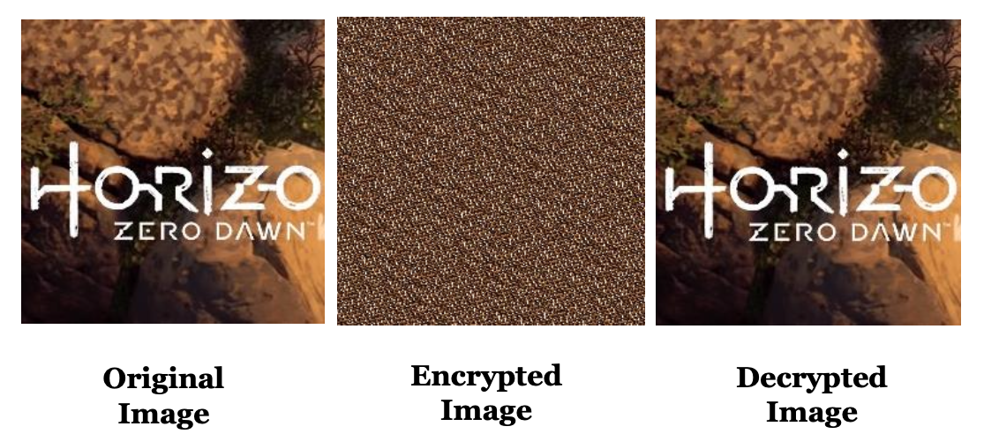

# 🌀 Chaos-Based Image Encryption: Arnold Cat & Henon Map

> **Harnessing nonlinear dynamical systems (Arnold Cat Map & Henon Map) to achieve confusion and diffusion for robust image encryption.**

---

## ❗ Problem Statement
Modern multimedia systems demand strong protection of visual data. Conventional ciphers struggle with large, high-correlation image datasets. This project applies chaos theory to craft encryption that is:
- Highly sensitive to initial conditions (keys)
- Pseudo-random and structure-destroying
- Resistant to statistical, brute-force, and differential attacks

---

This project uses the Arnold Cat Map transformation defined as:

$$
\begin{aligned}
x' = (x + y)\ mod N \\
y' = (x + 2y)\ mod N
\end{aligned}
$$

and the Henon map:

$$
\begin{aligned}
x_{n+1} &= 1 - a x_n^2 + y_n \\
y_{n+1} &= b x_n
\end{aligned}
$$

---

## 🧮 Methodology Snapshot

  

### 1️⃣ Arnold Cat Map Workflow
1. Load square image (pad if needed).
2. Apply matrix transform iteratively (key-driven iteration count).
3. Output permuted image (cipher stage 1).
4. Decrypt by inverse iteration (same count).

### 2️⃣ Henon Map Workflow
1. Initialize \(x_0, y_0, a, b\) ⇒ secret key set.
2. Iterate to produce chaotic float sequence.
3. Scale & quantize to 8-bit mask array matching image dimensions.
4. XOR original / permuted image with mask ⇒ ciphertext.
5. Regenerate mask with identical key to reverse XOR.

  

---

## 📊 Comparative Feature Grid
| Technique | Confusion | Diffusion | Key Sensitivity | Histogram Resistance | Speed |
|-----------|-----------|-----------|-----------------|----------------------|-------|
| Arnold Cat Map | ✅ High | ⚠️ Low | ✅ High | ⚠️ Moderate | 🚀 Fast |
| Henon Map | ✅ High | ✅ High | ✅ High | ✅ Strong | ⏱️ Medium |

---

## 🔍 Observations
> [!NOTE]
> Combining both (permutation + masking) forms a hybrid cipher with layered security.
- Arnold Cat alone keeps pixel values intact ⇒ vulnerable to statistical analysis if iteration count is small.
- Henon-based XOR alters value distribution ⇒ stronger entropy & flatter histograms.
- Parameter/key perturbations (1e-12 scale) yield dramatically different outputs.

---

## 🧠 Key Insights
- Chaotic dynamics naturally embed unpredictability + sensitivity ⇒ ideal cryptographic primitives.
- Multi-map or multi-phase designs (e.g., Cat → Henon → Diffusion pass) can mitigate singular weaknesses.
- Practical for real-time (low-latency) encryption in surveillance / telemedicine when optimized.

---

## 🔑 Parameter & Key Considerations
| Map | Primary Secret Components | Expansion Strategy |
|-----|---------------------------|--------------------|
| Cat | Iteration count k, image size N | Combine with dynamic iteration schedule |
| Henon | a, b, x0, y0, sequence length | Derive per-session seeds via KDF |

---

Made with chaos theory 🔁 for secure pixels

